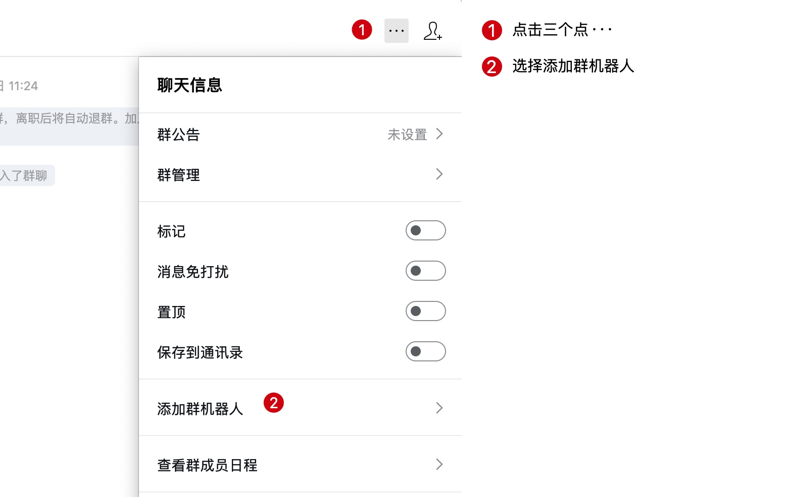
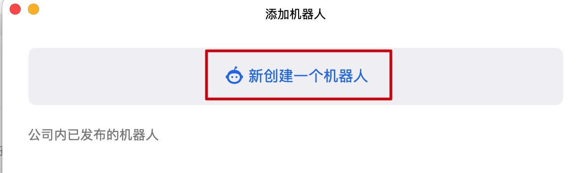
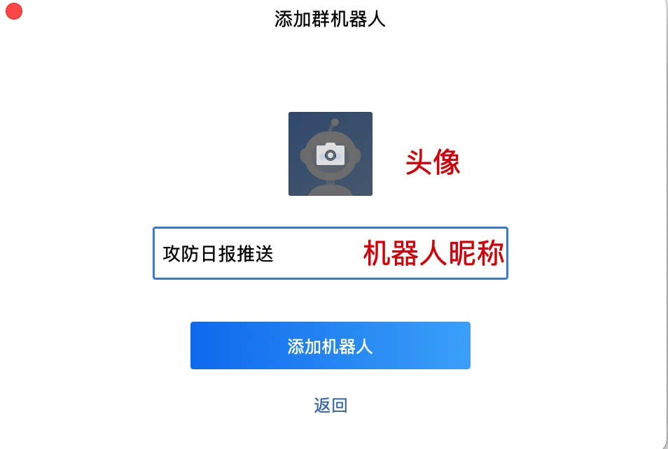
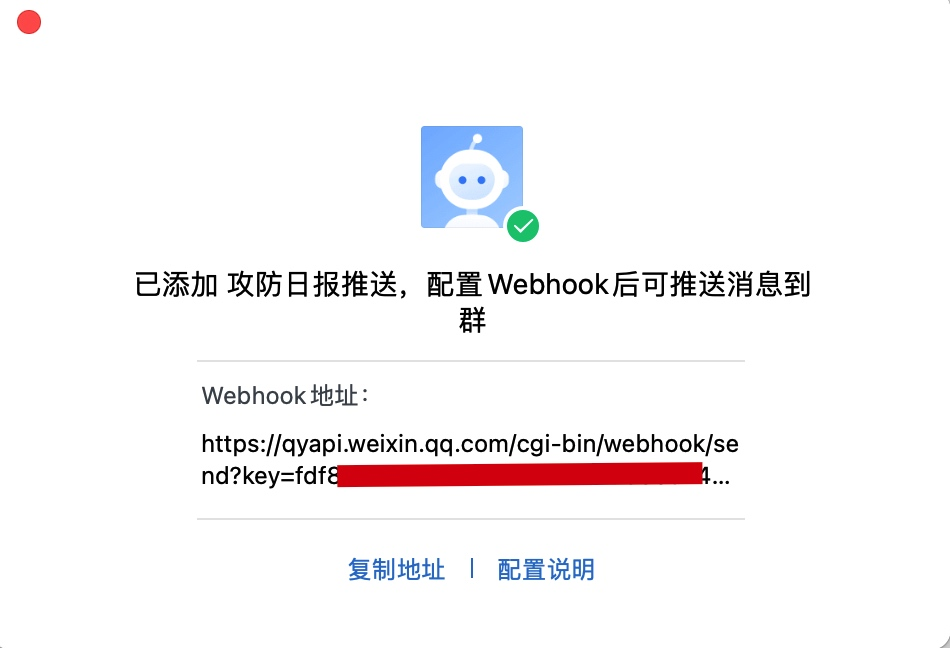
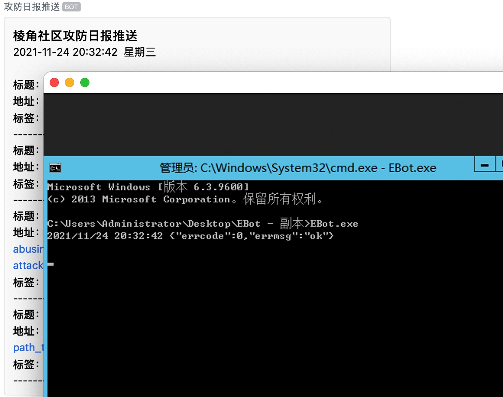

# EBot - 棱角社区攻防日报企业微信机器人

此机器人主要用作企业微信进行推送棱角社区攻防日报板块安全动态，每日10:00准时推送更新，可按照需求进行在代码内修改。

在以下位置进行修改每日推送时间。
```go
	Ebot()
	cron2 := cron.New() //创建一个cron实例
	//执行定时任务（每天10点执行一次）
	err:= cron2.AddFunc("0 0 10 * * ?", Ebot)
	if err!=nil{
		fmt.Println(err)
	}
```

## 使用方法

在企业微信群右上角点击三个点，如下图所示：



选择`新建一个机器人`：



在添加机器人窗口中设置头像与昵称，然后单击添加机器人：



将截图中打码部分，也就是`key=xxx`中的xxx部分复制至config.ini文件内：



```
Key=xxxxxxxx-xxxx-xxxx-xxxx-xxxxxxxxxxxx
```

> 替换xxx为机器人的key，注意Key中的K为大写。

随后可在服务器中运行`EBot`程序,最终效果如下：




